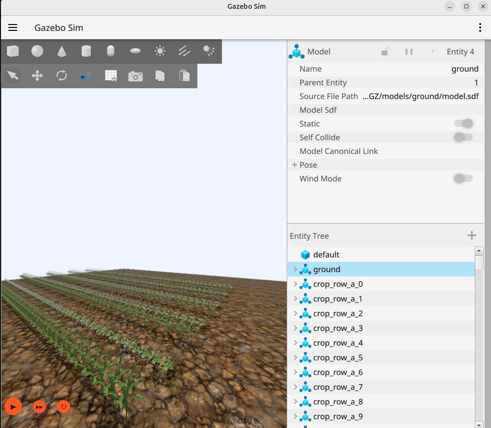

# 🌾 IntercroppingGZ

Procedural Gazebo (gz sim) environment for simulating intercropping agricultural fields.

Generates alternating crop rows, places plant models, configures lighting, and exports a ready-to-run SDF world for robotics and agricultural experiments.



---

## Quick Overview

- **ROS 2 package:** `intercropping_gz` (ament_cmake)
- **Generator:** `scripts/generate_world.py`
- **Models:** `models/` (crop_row_a, crop_row_b, ground, weed)
- **Output world:** `worlds/intercrop_world.sdf`
- **Config:** `config/config.yaml` (tweak layout and spacing)

---

## Features

- Procedural crop-row layout with alternating intercrop patterns
- Configurable rows, spacing, plant spacing, and field origin
- Uses OBJ + texture plant models and a ground model
- Adds lighting and sun so the generated world is simulation-ready
- Targeted for Gazebo / gz sim (HarmonIC-compatible)
- Packaged as a standard ROS 2 (ament_cmake) package for use in a colcon workspace

---

## Requirements

- ROS 2 (tested with Jazzy; other recent distros should work) with `colcon`
- `gz` (gz-sim / Gazebo Harmonic) installed and on `PATH`
- `python3` (3.8+ recommended) with `ament_index_python` and `PyYAML` (`python3-yaml`)

---

## Quick Start

Clone the repo into the `src` directory of a colcon workspace:

```bash
mkdir -p ~/ros2_ws/src
cd ~/ros2_ws/src
git clone https://github.com/patrikpordi/IntercroppingGZ.git intercropping_gz
```

Build the workspace and source the overlay:

```bash
cd ~/ros2_ws
colcon build --symlink-install --packages-select intercropping_gz
source install/setup.bash
```

Point Gazebo to the installed models directory and run the generator:

```bash
export GZ_SIM_RESOURCE_PATH="$(ros2 pkg prefix intercropping_gz)/share/intercropping_gz/models"
ros2 run intercropping_gz generate_world.py
gz sim --verbose 3 "$(ros2 pkg prefix intercropping_gz)/share/intercropping_gz/worlds/intercrop_world.sdf"
```

> Using `--symlink-install` means edits to `config/config.yaml` or the models take effect immediately without rebuilding.

---

## Configuration

Edit `config/config.yaml` to change basic parameters such as:

- `field.num_rows`, `field.row_length`, `field.row_spacing`, `field.plant_spacing`
- `origin.start_x`, `origin.start_y`, `origin.plant_z`
- `crops.even_rows`, `crops.odd_rows` — which models alternate between rows
- `crops.even_rows_collision`, `crops.odd_rows_collision` — set `false` to spawn that row's plants without collision geometry (visual-only, via a `_no_collision` model variant); defaults to `true`
- `ground.model`, `ground.pose`
- `lighting` and `sun` — scene ambient/background and sun pose/color/direction
- `world.name`, `world.output_file`

The generator resolves its own package share directory via `ament_index_python`, loads `config/config.yaml` from it, places models from `models/`, and writes the SDF to `worlds/intercrop_world.sdf` (back in the source tree if installed with `--symlink-install`).

See the generator itself for the full list of options: [scripts/generate_world.py](scripts/generate_world.py)

---

## Project layout

- `package.xml`, `CMakeLists.txt` — ROS 2 (ament_cmake) package definition
- `models/` — Gazebo model folders (crop_row_a, crop_row_b, ground, weed)
- `scripts/generate_world.py` — world generator, installed as a `ros2 run` executable
- `worlds/` — generated SDF files (output)
- `config/config.yaml` — generator configuration

---

## Tips & Notes

- Verify that `GZ_SIM_RESOURCE_PATH` points to the installed `models/` directory so gz can find the models.
- You can preview the generated SDF in a text editor or open it directly with `gz sim`.
- Replace or add model folders under `models/` to experiment with different plants or assets.
- Building with `colcon build --symlink-install --packages-select intercropping_gz` avoids having to rebuild after every config or model change.

---

## Contributing

Contributions welcome — open issues or PRs for bug fixes, new plant models, or generator improvements.

---

## License

MIT — see [LICENSE](LICENSE).
